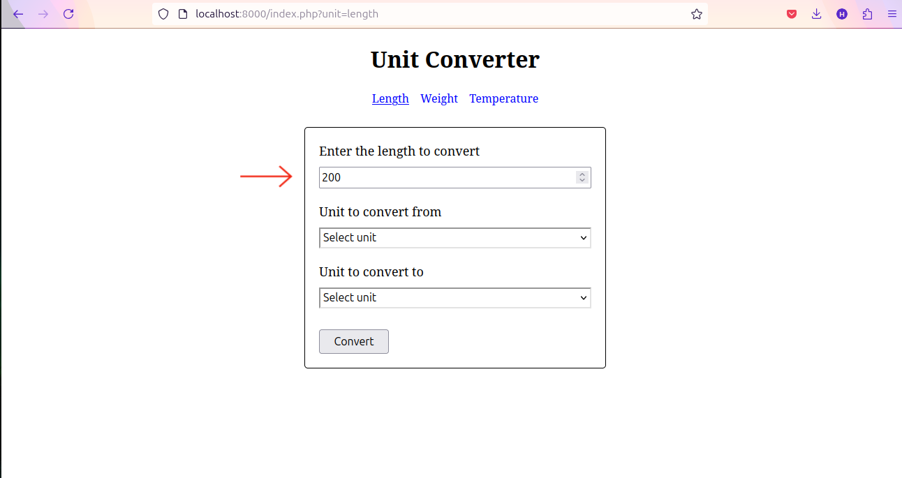

# PHP Unit Converter
> Simple unit converter web app built with HTML, CSS, and PHP.

## Table of Contents
* [General Info](#general-information)
* [Technologies Used](#technologies-used)
* [Features](#features)
* [Setup](#setup)
* [Usage](#usage)
* [Project Status](#project-status)
* [Acknowledgements](#acknowledgements)

## General Information
PHP Unit Converter a simple web application that can convert between different units of measurement. It can convert units of length, weight, volume, area, temperature, and more. The user can input a value and select the units to convert from and to. The application will then display the converted value. This project is designed to explore and practice logic building and working with the HTML, CSS and server in PHP.

## Technologies Used
- HTML
- CSS
- PHP - version 8.3.6

## Features
This app can convert between different units of measurement for length, weight and temperature. Supported conversions include:
- **Length**:
  - millimeter (mm)
  - centimeter (cm)
  - meter (m)
  - kilometer (km)
  - inch (in)
  - foot (ft)
  - yard (yd)
  - mile (mi)

- **Weight**:
  - milligram (mg)
  - gram (g)
  - kilogram (kg)
  - ounce (oz)
  - pound (lb)

- **Temperature**:
  - Celsius (°C)
  - Fahrenheit (°F)
  - Kelvin (K)

## Setup
To run this web app, you’ll need:
- **PHP**: Version 8.3 or newer

How to install:
1. Clone the repository
   ```bash
   git clone https://github.com/krisnaajiep/php-unit-converter.git
   ```

2. Change the current working directory
   ```bash
   cd path/php-unit-converter
   ```

3. Run the PHP built-in web server
   ```bash
   php -S localhost:8000
   ```

4. Access the URL
   ```bash
   http://localhost:8000
   ```

## Usage
1. Select one of the units of measurement in the navigation menu.
   
   
   
2. Input a value to convert.
   
   

3. Select the units to convert from.

   

4. Select the units to convert to.

   

5. Select the `Convert` button.

   

6. View the converted value.

   

## Project Status
Project is: _complete_.

## Acknowledgements
This project was inspired by [roadmap.sh](https://roadmap.sh/projects/unit-converter).
